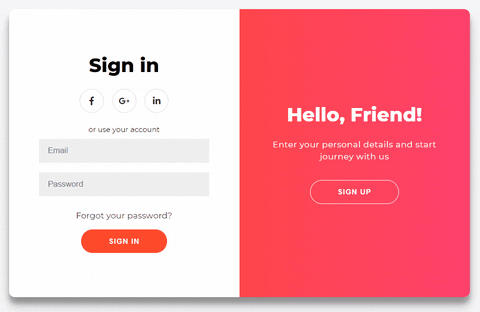

## Olá! :wave: Neste repositório encontra-se uma página HTML com a funcionalidade de registar-se e iniciar sessão.

# :ledger: Página funcional para log in e registar.

Pequena demonstração:-



# :books: Descrição do projeto

Sessões e funcionalidades


4 pequenas **caixas** dentro do componente principal (  o ```.container```  ):

1. Log in form
2. Registar form
3. Log in overlay
4. Registar overlay
   
Nos overlays temos um pouco de texto e um ````botão```` - clicando nele podemos iniciar sessão ou registar-se.

# :label: Explicação sobre animação

Basicamente, temos dois containers - o ``.form-container`` - cada um com a ``width`` de ``50%`` e a ``position`` - ``absolute``. Quando clicado, podemos alternar entre a opção de iniciar sessão ou registar.

# :clipboard: HTML & Javascript

Esqueleto do código:

```html
<div class="container" id="container">
    <div class="form-container sign-up-container">
        <!-- Código de registro -->
    </div>
    <div class="form-container sign-in-container">
        <!--  Código de login  -->
    </div>
    <div class="overlay-container">
        <!-- Código do Overlay  -->
    </div>
</div>
```

### Log in:

```html
<div class="form-container sign-up-container">
    <form action="#">
        <h1>Criar Conta</h1>
        <div class="social-container">
            <a href="#" class="social"><i class="fab fa-facebook-f"></i></a>
            <a href="#" class="social"><i class="fab fa-google-plus-g"></i></a>
            <a href="#" class="social"><i class="fab fa-linkedin-in"></i></a>
        </div>
        <span>ou user o seu email para registar</span>
        <input type="text" placeholder="Name" />
        <input type="email" placeholder="Email" />
        <input type="password" placeholder="Password" />
        <button>Registar</button>
    </form>
</div>
```

### Registar:

```html
<div class="form-container sign-in-container">
    <form action="#">
        <h1>Iniciar sessão</h1>
        <div class="social-container">
            <a href="#" class="social"><i class="fab fa-facebook-f"></i></a>
            <a href="#" class="social"><i class="fab fa-google-plus-g"></i></a>
            <a href="#" class="social"><i class="fab fa-linkedin-in"></i></a>
        </div>
        <span>ou usar a sua conta</span>
        <input type="email" placeholder="Email" />
        <input type="password" placeholder="Password" />
        <a href="#">Esqueceu a palavra passe?</a>
        <button>Iniciar sessão</button>
    </form>
</div>
```

### Javascript

```html
const signUpButton = document.getElementById('signUp');
const signInButton = document.getElementById('signIn');
const container = document.getElementById('container');

signUpButton.addEventListener('click', () => {
    container.classList.add('right-panel-active');
});

signInButton.addEventListener('click', () => {
    container.classList.remove('right-panel-active');
});
```
